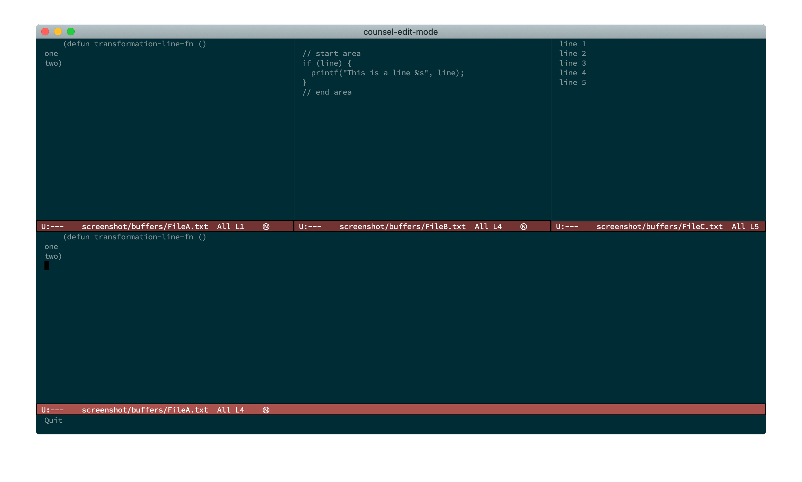

   # counsel-edit-mode.el 
[](https://www.gnu.org/licenses/gpl-3.0.txt)
[](https://github.com/tyler-dodge/counsel-edit-mode/releases)
[](https://travis-ci.com/github/tyler-dodge/counsel-edit-mode) [](https://coveralls.io/github/tyler-dodge/counsel-edit-mode)

---

# Overview

This provides an action for use with 
`counsel-ag`, `counsel-rg`, `counsel-git-grep`, `counsel-ack`, and `counsel-grep`.

It can be installed with:
```
(counsel-edit-mode-setup-ivy)
``` 

# Installation 

Comin Soon to Melpa!

# Features
* Edit search results from multiple files at once.
* Expand the search result context so that all matching delimiters are matched. This allows
for structural editing on search output.
* Ediff support for viewing changes made in the `counsel-edit-mode` bufffer.

# Screenshot



# Usage

Once installed, run any of the counsel search commands. Once they start returning results, 
type <kbd>M-o e</kbd> to open up the `counsel-edit-mode` buffer to edit the results.

# Keymap

## counsel-edit-mode

| Key           | Action                                            |
|:--------------|:--------------------------------------------------|
| `C-c C-c`     | Commit Changes                                    |
| `C-c C-k`     | Discard Changes                                   |
| `C-c C-l`     | Goto buffer referenced at line                    |
| `C-c C-u`     | Undo modifications to current line                |
| `C-c C-e`     | Expand current section for missing delimiters     |
| `C-u C-c C-e` | Expand all files in buffer for missing delimiters |
| `C-c C-m`     | Change major mode for current buffer              |
| `C-c C-d`     | Mark line for deletion                            |
| `C-c C-p`     | Expand file at point's context up one line        |
| `C-c C-n`     | Expand file at point's context down one line      |
| `C-c C-r`     | Revert buffer with disk contents                  |

## counsel-edit-ediff-mode

| Key           | Action                                            |
|:--------------|:--------------------------------------------------|
| `C-c C-c`     | Commit Changes                                    |

# Customization

* [counsel-edit-mode-major-mode](counsel-edit-mode-major-mode) <a name="counsel-edit-mode-major-mode"></a>The default major-mode used by the
`counsel-edit-mode` buffer. This can be changed per `counsel-edit-mode` buffer by calling `counsel-edit-mode-change-major-mode` in that buffer.

* [counsel-edit-mode-expand-braces-by-default](counsel-edit-mode-expand-braces-by-default) <a name="counsel-edit-mode-expand-braces-by-default"></a>The default major-mode used by the
When this is set non-nil, `counsel-edit-mode` will expand the context of each file until all matching delimeters are closed. This can be done manually per section by calling `counsel-edit-mode-expand-section`.
If `counsel-edit-mode-expand-section` is called with a prefix arg, it will expand every section in the buffer.

* [counsel-edit-mode-confirm-commits](counsel-edit-mode-confirm-commits) <a name="counsel-edit-mode-confirm-commits"></a>The default major-mode used by the
When this is set non-nil, `counsel-edit-mode` will confirm commits with showing the changes in ediff. 
<kbd>C-c C-c</kbd> confirms the changes in ediff whereas <kbd>q</kbd> will close the ediff session.

## Contributing

Contributions welcome, but forking preferred.
I plan to actively maintain this, but I will be prioritizing features that impact me first.

I'll look at most pull requests eventually, but there is no SLA on those being accepted.

Also, I will only respond to pull requests on a case by case basis.
I have no obligation to comment on, justify not accepting, or accept any given pull request.
Feel free to start a fork that has more support in that area.

If there's a great pull request that I'm slow on accepting, feel free to fork and rename the project.
